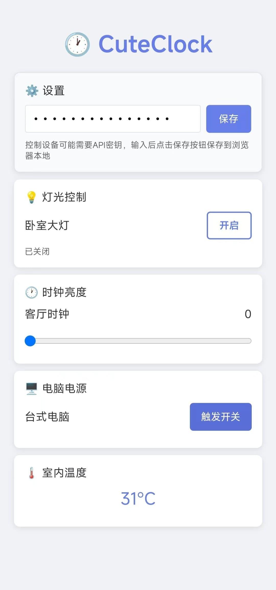

# 🕐 CuteClock - 智能时钟显示器

基于 ESP8266 的多功能智能时钟，支持时间显示、天气获取、室内温度监测和小爱同学语音控制。


**多端控制展示**

|                        小程序                        |                       Web                       |                       小爱同学                       |                      点灯科技 App                      |
| :--------------------------------------------------: | :---------------------------------------------: | :--------------------------------------------------: | :----------------------------------------------------: |
|  |  |  |  |

## ✨ 功能特性

### 🕒 时钟功能

- **网络时间同步**：通过 NTP 自动获取准确时间
- **离线时间保持**：DS3231 高精度时钟模块，断网时间依然准确
- **自动亮度调节**：根据时间自动调整显示亮度
- **多种显示模式**：时间、日期、温度、天气轮换显示

### 🌤️ 天气功能

- **实时天气**：通过点灯科技获取实时天气信息
- **本地温度**：DS3231 内置温度传感器监测室内温度
- **天气显示**：LED 点阵屏显示天气状态和温度

### 🏠 智能家居

- **灯光控制**：通过继电器控制房间灯具
- **远程控制**：支持点灯科技 App 远程控制
- **小爱同学**：支持小爱同学语音控制
- **PC 控制**：支持远程开关电脑

### 🌐 网络功能

- **WiFi 连接**：自动连接配置的 WiFi 网络
- **HTTP 服务**：内置 Web 服务器，支持 RESTful API
- **API 安全认证**：敏感接口支持密钥验证保护
- **UDP 广播**：设备发现和状态广播
- **配套小程序**：支持微信小程序控制
- **内置 Web 控制面板**：直接访问设备 IP 即可控制

### 📱 控制方式

- **点灯科技 App**：官方 App 远程控制
- **小爱同学**：语音控制灯光和电脑
- **HTTP API**：RESTful 接口控制
- **微信小程序**：便捷的移动端控制
- **内置 Web 控制面板**：浏览器访问 `http://设备IP:1229/`
- **物理按键**：硬件按键直接控制（可扩展）

## 🎯 应用场景

- **卧室时钟**：床头时钟显示，智能控制床头灯
- **办公桌时钟**：工作区时间显示，远程控制电脑开关
- **客厅装饰**：客厅时钟装饰，控制客厅灯光
- **智能家居中心**：作为家居控制节点，集成多种功能

## 🚀 快速开始

### 📋 准备步骤

按照以下顺序完成项目搭建：

1. **📃 [硬件准备与连接](docs/hardware-setup.md)**
   - 购买所需硬件元件
   - 按照电路图完成硬件连接
   
2. **🚀 [配置文件设置](docs/configuration.md)**

   - 复制并编辑配置文件
   - 填写 WiFi 和点灯科技密钥

3. **🔧 [开发环境搭建](docs/development-setup.md)**

   - 安装 Arduino IDE 和驱动
   - 编译和上传代码

4. **💻 [软件设置](docs/software-setup.md)**
   - 配置点灯科技 APP 界面
   - 设置小爱音箱语音控制

### ⚡ 快速部署

如果您已经熟悉 Arduino 开发，可以快速部署：

```bash
# 1. 克隆项目
git clone https://github.com/AkenClub/CuteClock.git

# 2. 复制配置文件
cd CuteClock/firmware
cp UserConfig.example.h UserConfig.h

# 3. 编辑配置文件
# 修改 WiFi 信息和点灯科技密钥

# 4. 使用 Arduino IDE 编译上传
```

## 📖 项目结构

```
CuteClock/
├── firmware/                   # ESP8266 固件代码
│   ├── firmware.ino            # 主程序文件
│   ├── UserConfig.example.h    # 配置文件模板
│   ├── WebControl.h            # 内置 Web 控制页面源码
│   └── ...                     # 其他功能模块
├── clients/                    # 客户端应用
│   └── wechat-miniprogram/     # 微信小程序
├── docs/                       # 文档目录
│   ├── images/                 # 图片资源
│   ├── hardware-setup.md       # 硬件准备指南
│   ├── configuration.md        # 配置文件说明
│   ├── development-setup.md    # 开发环境搭建
│   └── software-setup.md       # 软件配置指南
└── README.md                   # 项目说明
```

## 🔌 HTTP API 控制

项目内置了完整的 HTTP API 接口，支持通过网络请求控制设备：

- **RESTful 设计**：标准的 REST API 接口
- **JSON 数据格式**：易于集成和解析
- **安全认证**：敏感控制接口可以使用 API 密钥验证
- **多平台支持**：支持任何能发起 HTTP 请求的平台

**📖 详细的 API 使用说明和安全配置请参考：[HTTP API 使用指南](docs/api-usage.md)**

## 📱 客户端应用

### 微信小程序

- **状态**: 已开源到 `clients/wechat-miniprogram/`
- **功能**: 移动端便捷控制，支持灯光、时钟亮度、电脑电源控制
- **特点**: 基于微信平台，无需安装额外应用
- **技术栈**: 微信小程序原生开发，支持实时设备状态监控

### 内置 Web 控制面板

- **访问方式**: 浏览器访问 `http://设备IP:1229/`
- **功能**: 灯光开关、时钟亮度、电脑电源、温度显示
- **特点**: 零部署、轻量、即开即用

### 第三方开发

如果您想开发自己的客户端应用：

- 📚 参考 [HTTP API 使用指南](docs/api-usage.md)
- 🤝 欢迎贡献您的客户端实现到 `clients/` 目录

## 🛠️ 技术栈

- **硬件平台**：ESP8266 (NodeMCU)
- **开发环境**：Arduino IDE
- **显示屏**：MAX7219 LED 点阵
- **时钟模块**：DS3231 RTC
- **云平台**：点灯科技 (Blinker)
- **通信协议**：WiFi, HTTP, UDP, I2C, SPI

## ⚡ 供电说明

**推荐供电方式：**

- 使用 5V/1A 以上的 USB 电源适配器（推荐）
- 机箱 USB 3.0 接口供电（作者实际使用方案，运行稳定）

**供电注意事项：**

- 机箱 USB 供电可能存在电流不足风险，请根据实际情况评估
- 如遇到设备重启或工作不稳定，建议更换独立电源适配器

## ⚠️ 免责声明

**电气安全：**

- 本项目涉及电路连接和电气操作，请确保具备基础的电子知识
- 所有电路连接和改装均由使用者自行承担风险和责任
- 作者不承担因使用本项目导致的任何设备损坏或安全事故

**代码质量：**

- 这是作者的第一个硬件项目，初版代码写于几年前
- 作者未系统学习过 C++，代码可能存在不规范之处，敬请包涵
- 欢迎有经验的开发者提出改进建议

## 🙏 致谢

本项目基于 [esp8266-lattice-clock-open](https://gitee.com/lengff/esp8266-lattice-clock-open) 项目进行开发，在原有基础上加入了点灯科技云平台集成和小爱同学语音控制功能。感谢原作者的开源贡献！

**项目初衷：**

- 保留完整的源代码和电路图资料以备将来使用
- 分享给有类似需求的朋友

## 🤝 贡献

欢迎提交 Issue 和 Pull Request 来改进项目！

### 贡献指南

1. Fork 项目
2. 创建功能分支 (`git checkout -b feature/AmazingFeature`)
3. 提交更改 (`git commit -m 'Add some AmazingFeature'`)
4. 推送到分支 (`git push origin feature/AmazingFeature`)
5. 打开 Pull Request

## 📄 许可证

该项目基于 MIT 许可证 - 查看 [LICENSE](LICENSE) 文件了解详情。

## 🔗 相关链接

- [点灯科技官网](https://diandeng.tech/)
- [ESP8266 Arduino Core](https://github.com/esp8266/Arduino)
- [Arduino IDE 下载](https://www.arduino.cc/en/software)

## 📞 支持

如果在使用过程中遇到问题：

1. 查看对应的文档说明
2. 检查配置文件是否正确
3. 查看串口监视器的错误信息
4. 提交 Issue 到项目仓库

---

⭐ 如果这个项目对您有帮助，请给个 Star 支持一下！
