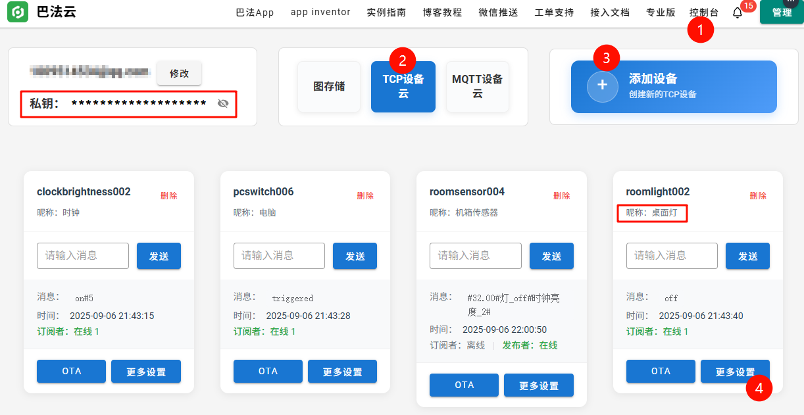

# 巴法云集成使用说明

本文档介绍如何在 CuteClock 项目中同时使用点灯科技和巴法云平台，并通过巴法云接入小爱同学控制。

推荐使用 `巴法云` 平台，支持添加多个设备，支持设置设备昵称。

还支持巴法云控制台直接输入指令控制，相当于多了一种远程控制方式，即使没有米家 APP 也能控制。


## 🔧 配置步骤

### 1. 巴法云平台配置

1. 访问 [巴法云官网](https://cloud.bemfa.com/)
2. 注册账号并登录
3. 在控制台获取您的用户 UID （私钥）
4. 在控制台选择`TCP设备云`，点击添加设备 - 选择自定义主题 - 创建以下主题（注意命名规则和设备类型后缀）：
   - `roomlight002` - 灯泡设备（用于小爱同学控制开关灯）
   - `clockbrightness002` - 时钟亮度设备（用于小爱同学控制时钟亮度）
   - `roomsensor004` - 传感器设备（用于温度数据上报）
   - `pcswitch006` - 开关设备（用于小爱同学控制PC电源）
5. 在每个主题点击`更多设置`-`修改设备昵称`，可以设置为自己设备的名称，之后小爱同学就是识别该设备了。

   

💡 **主题命名规则**：
- ⚠️ **重要**：主题名只能包含字母和数字，不能使用下划线、中划线等特殊字符
- 主题名可以自定义前缀，但后缀必须严格按照巴法云设备类型规则
- [巴法云小爱同学接入指南](https://cloud.bemfa.com/docs/src/speaker_mi.html)

### 2. 修改配置文件

复制 `firmware/UserConfig.example.h` 为 `firmware/UserConfig.h`，并修改以下配置：

```cpp
// 巴法云配置
#define UserBemfaUID "您的巴法云UID"               // 从巴法云控制台获取
// 建议只修改用户UID即可，其他保持不变，以保证代码正常运行
#define UserBemfaLightTopic "roomlight002"         // 灯光控制主题名（只能包含字母数字）
#define UserBemfaBrightnessTopic "clockbrightness002" // 时钟亮度控制主题名（只能包含字母数字）
#define UserBemfaSensorTopic "roomsensor004"       // 传感器数据主题名（只能包含字母数字）
#define UserBemfaSwitchTopic "pcswitch006"         // 开关控制主题名（只能包含字母数字）
```

### 3. 编译上传固件

使用 Arduino IDE 编译并上传 `firmware/firmware.ino` 到您的 ESP8266 设备。

### 4. 米家配置

进入米家 APP - 我的 - 添加其他平台 - 添加 - 选择`巴法云` - 使用巴法云账号登录 - 同步设备。

同步成功后，即可使用上面设置的设备昵称来控制，比如：“小爱同学，打开电脑”。

也可以在小爱同学的`训练计划`中设置更加复杂的执行计划。

## 🎮 小爱同学控制说明

**使用上面设置的设备昵称控制：**

### 灯光控制

```
小爱同学，打开桌面灯
小爱同学，关闭桌面灯
```

### 时钟亮度控制

```
小爱同学，把时钟调到最亮
小爱同学，把时钟调到最暗
小爱同学，把时钟亮度调到 5
```

### 传感器查询

```
小爱同学，查询机箱传感器温度
```

### PC电源控制

```
小爱同学，打开电脑
小爱同学，关闭电脑
```

## ☁️ 巴法云控制台控制说明

在控制台中，可以在每个主题的输入框中输入指令后点击发送到设备。

- 输入`on`或`off`来控制灯光状态，
- 输入`on#亮度值`来控制时钟亮度，
- 输入`on`或`off`来控制 PC 电源进行一次开关操作。


## 📊 数据格式说明

### 传感器数据

上报时机：每次心跳时上报，心跳间隔为 1 分钟。每次给设备设置指令后也会上报。

巴法云传感器设备使用特定格式上传数据：

```
#温度#开关_开关值#灯_状态值#时钟亮度_亮度值#
```

示例：
- `#23.5#灯_on#时钟亮度_8#` - 温度23.5°C，灯光开启，时钟亮度8
- `#25.2#灯_off#时钟亮度_1#` - 温度25.2°C，灯光关闭，时钟亮度1


## 🔗 相关链接

- [巴法云官方文档](https://cloud.bemfa.com/docs/)
- [巴法云TCP协议说明](https://cloud.bemfa.com/docs/src/tcp.html)
- [巴法云小爱同学接入指南](https://cloud.bemfa.com/docs/src/speaker_mi.html)
