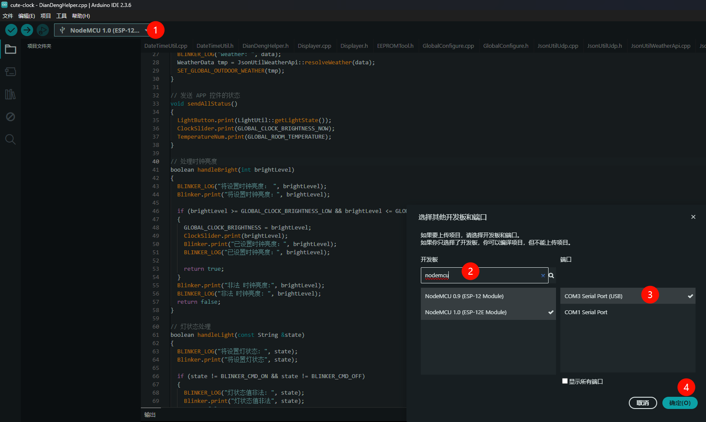

# 🔧 开发环境搭建和编译上传

## 🖥️ Arduino IDE 安装

1. **下载 Arduino IDE**：[Arduino IDE 官方下载](https://support.arduino.cc/hc/en-us/articles/360019833020-Download-and-install-Arduino-IDE)

## 🔌 驱动安装

### NodeMCU/ESP8266 驱动 (CP210X) 安装

插上开发板后，在设备管理器中查看设备，如果出现未知设备，则需要安装驱动，否则无法识别开发板：

**参考教程：**
- [ESP8266-NodeMCU开发板驱动安装 – 太极创客](http://www.taichi-maker.com/homepage/esp8266-nodemcu-iot/iot-c/install-esp8266-nodemcu-driver/)
- [CP210x USB to UART Bridge VCP Drivers - Silicon Labs](https://www.silabs.com/software-and-tools/usb-to-uart-bridge-vcp-drivers?tab=downloads)

**Windows 驱动下载：** [CP210x Windows Drivers](https://www.silabs.com/documents/public/software/CP210x_Windows_Drivers.zip)

下载后运行 `CP210xVCPInstaller_x64.exe` 进行安装，可能需要重启电脑，之后在设备管理器中查看是否安装成功，记住端口（例如：COM3），后续在Arduino IDE中选择对应的端口：

## ⚙️ ESP8266 开发板配置

### 添加开发板管理网址

在 Arduino IDE 中添加 ESP8266 开发板支持：

左上角 文件 -> 首选项 -> 附加开发板管理网址：

**附加开发板管理网址：** `http://arduino.esp8266.com/stable/package_esp8266com_index.json`

### 开发板选择

- **测试版本：** ESP8266 by ESP8266 Community 3.0.1
- **开发板选择：** NodeMCU 1.0 (ESP-12E Module)

## 📚 依赖库安装

需要安装以下库文件（通过 Arduino IDE 库管理器安装）：

**必需库清单：**
- 库名称 - 版本号
- **TickTwo** - 4.4.0
- **DS3231** - 1.1.0
- **MD_MAX72XX** - 3.3.1
- **MD_Parola** - 3.6.2 （可能需要选择"仅安装库"）
- **ArduinoJson** - 6.20.1
- **Blinker** - 0.3.9

## 🚀 编译和上传

配置完成后：

1. 选择正确的开发板（NodeMCU 1.0 ESP-12E Module）
2. 选择正确的串口
3. 编译并上传代码

### ⚠️ 上传注意事项

**重要：** 如果正在查看串口监视器时，可能无法上传代码。上传代码前需要先关闭串口监视器。

## 🐛 常见问题

### 编译错误
1. 检查是否安装了所有必需的库
2. 确认库版本是否匹配
3. 检查开发板配置是否正确

### 上传失败
1. 确认驱动是否正确安装
2. 检查串口选择是否正确
3. 关闭串口监视器后重试
4. 尝试按住开发板上的FLASH按钮后上传

### 运行异常
1. 检查配置文件是否正确
2. 查看串口监视器的错误信息
3. 确认硬件连接是否正确
