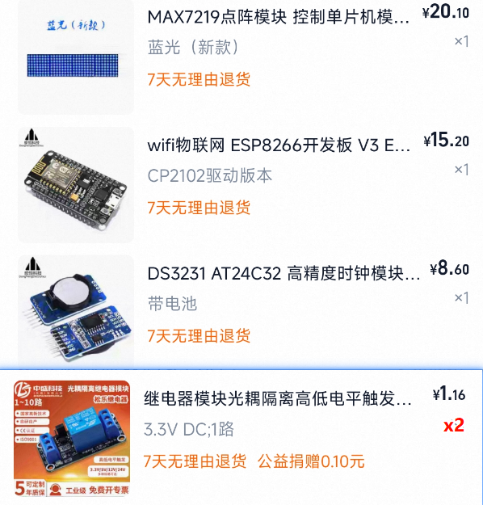
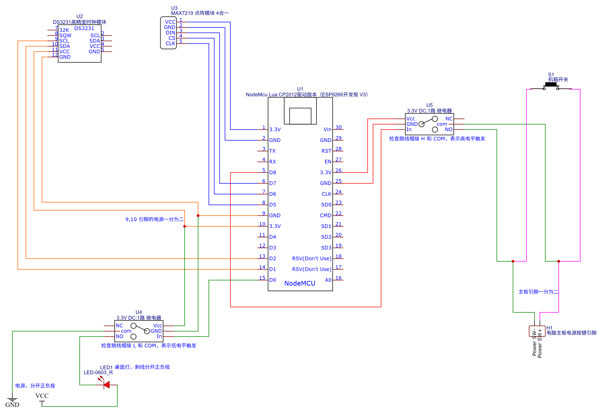

# 📃 硬件准备

## 🛒 所需硬件清单

- 1个 NodeMcu Lua CP2012驱动版本（ESP8266开发板 V3）
- 1个 DS3231 高精度时钟模块
- 2个 3.3V DC 1路继电器
- 1个 MAX7219 点阵模块4合1
- 若干杜邦线，包括公对公、母对母、公对母（可选）

## 🔌 电路连接图

## 📋 硬件说明

### NodeMCU ESP8266 开发板
- 主控芯片，负责WiFi连接和程序运行
- 内置CP2102 USB转串口芯片，方便调试

### DS3231 时钟模块
- 高精度实时时钟模块
- 内置温度补偿，断电时间保持
- 通过I2C接口与ESP8266通信

### 3.3V 继电器模块
- 用于控制外部电器设备
- 支持高低电平触发
- 隔离保护，安全可靠

### MAX7219 点阵模块
- 4合1 LED点阵显示屏
- 支持级联，可扩展显示区域
- SPI接口，控制简单

## 🔧 连接说明

具体的引脚连接请参考电路连接图，确保：
1. 电源连接正确（3.3V/5V）
2. 通信引脚连接无误
3. 接地线连接良好

## ⚠️ 注意事项

1. **电源电压**：确保所有模块的工作电压匹配
2. **连接稳固**：使用可靠的连接方式，避免接触不良
3. **静电防护**：操作前请释放静电，避免损坏电子元件
4. **极性注意**：注意电源正负极，避免反接
