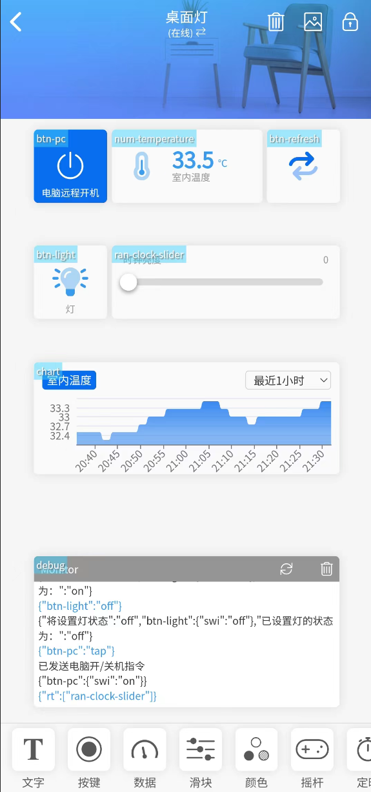

# 💻 软件设置

完成硬件连接、配置文件设置和代码上传后，需要进行软件端的配置以实现完整的功能。

## 📱 点灯科技 APP 控制

### 设备界面配置

完成代码上传且正确配置后，此时在设备列表中会看到设备已显示"在线"状态。

**配置步骤：**

1. 进入创建的设备
2. 点击右上角 "..." 菜单 → 界面配置
3. 粘贴以下配置内容
4. 点击"更新配置"
5. 返回到设备列表，再次点击进入设备详情即可生效

**界面配置 JSON：**

```json
{¨version¨¨2.0.0¨¨config¨{¨headerColor¨¨transparent¨¨headerStyle¨¨dark¨¨background¨{¨img¨¨assets/img/headerbg.jpg¨}}¨dashboard¨|{¨type¨¨btn¨¨ico¨¨fad fa-lightbulb-on¨¨mode¨Ê¨t0¨´灯´¨clr¨¨#389BEE¨¨t1¨¨文本2¨¨bg¨Ê¨cols¨Ë¨rows¨Ë¨key¨¨btn-light¨´x´É´y´Î¨speech¨|÷¨lstyle¨É}{ßB¨deb¨ßFÉßLÉßMÑßNÍßO¨debug¨´x´É´y´¤DßQ|÷ßRÊ}{ßB¨ran¨ßG¨时钟亮度¨ßH¨#076EEF¨¨max¨¤F¨min¨ÉßLÊßMÏßNËßO¨ran-clock-slider¨´x´Ë´y´ÎßQ|÷ßRʨrt¨»}{ßB¨num¨ßG¨室内温度¨ßD¨fad fa-thermometer-three-quarters¨ßHßIßYÉßX¢1c¨uni¨´℃´ßLÊßMÍßNËßO¨num-temperature¨´x´Ë´y´ËßQ|÷ßRÊ}{ßBßCßD¨fad fa-repeat-alt¨ßFÉßG´´ßJßKßLÊßMËßNËßO¨btn-refresh¨´x´Ï´y´ËßQ|÷ßRÉßHßW}{ßB¨cha¨ßLʨsty¨¨line¨ßHßW¨sty1¨ßk¨clr1¨ßI¨sty2¨ßk¨clr2¨ßIßMÑßNÌßO¨chart¨´x´É´y´Ñ¨key0¨¨chart-temperature¨ßGßc}{ßBßCßD¨fal fa-power-off¨ßFÉßG¨电脑远程开机¨ßJßKßLÉßMËßNËßO¨btn-pc¨´x´É´y´ËßHßW}÷¨actions¨|¦¨cmd¨¦ßu‡¨text¨‡¨on¨¨打开电脑¨¨off¨¨关闭电脑¨—{ßw{ßh¨tap¨}ßx´´}÷¨triggers¨|{¨source¨¨switch¨¨source_zh¨¨开关状态¨¨state¨|ßyß10÷¨state_zh¨|´打开´´关闭´÷}÷ßa|ßZ÷}
```



### 界面功能说明

配置完成后，您将在点灯科技 APP 中看到以下控制界面：

- **🔆 灯光开关**：控制房间灯具开关
- **🔅 时钟亮度调节**：滑动条调节 LED 显示亮度（0-15）
- **🌡️ 室内温度显示**：实时显示 DS3231 检测的温度
- **🔄 刷新按钮**：手动刷新设备状态
- **📊 温度图表**：历史温度数据图表
- **💻 电脑控制**：远程控制电脑开关机

### ⚠️ 配置注意事项

- 上面的配置仅供参考，您可以在设备详情右上角点击编辑按钮自行修改界面
- **重要**：组件键名（key）与代码一一对应，**不能修改键名**，否则功能失效
- 可以自定义颜色、图标、位置等界面元素

## 🎤 小爱音箱控制

### 基础设备绑定

**绑定步骤：**

1. 打开 **米家 APP**
2. 点击 **我的** → **添加其他平台** → **添加**
3. 搜索 **"点灯科技"** → **绑定账号**
4. 点击 **同步设备**
5. 成功后会在设备列表中看到一个 **"桌面灯"** 设备

### 基础语音控制

绑定成功后，即可通过小爱同学进行基础控制：

**支持的语音命令：**
- "打开桌面灯" / "关闭桌面灯"
- "把桌面灯亮度调到一" （亮度范围：0-15，对应配置 `UserClockBrightnessMax`）

### 高级功能：控制电脑开关

利用小爱音箱的场景模式，可以实现语音控制电脑开关机。

#### 原理说明

- 利用小爱训练功能
- 在代码中监听桌面灯设置 **"电脑模式"** 场景
- 当检测到电脑模式时，实际执行的是触发电脑电源开关的操作

#### 配置步骤

**第一步：小爱训练设置**

1. 打开 **小爱音箱 APP**
2. 选择某个音箱设备
3. 点击 **小爱训练** → 登录小米账号
4. 选择 **个人训练** → **添加**

**第二步：语音命令设置**

5. **对小爱说**：`打开电脑`、`关闭电脑`
6. **小爱会执行**：
   - 添加操作 → 设备控制
   - 选择 **桌面灯**
   - 设置：**灯设为电脑模式**

**第三步：执行范围设置**

7. **生效设备**：全部设备（包含小米手机的小爱同学）
8. **响应方式**：全部执行（默认）
9. **静默执行**：关闭（默认，可自定义）

#### 完成后支持的语音命令

- "小爱同学，打开电脑"
- "小爱同学，关闭电脑"

#### ⚠️ 重要说明

- **设备状态检测限制**：无法判断电脑当前是开机还是关机状态
- **工作原理**：语音命令只是模拟人手按下电脑电源开关按钮
- **实际效果**：
  - 如果电脑处于关机状态，说"打开电脑"会开机
  - 如果电脑处于开机状态，说"打开电脑"会触发关机
  - 相当于物理按下电源开关的效果

## 🔧 故障排除

### 设备离线问题
1. 检查 WiFi 连接是否正常
2. 确认配置文件中的 WiFi 信息正确
3. 查看串口监视器的连接日志

### 界面配置失效
1. 确认 JSON 配置格式正确
2. 检查组件键名是否与代码匹配
3. 重新粘贴配置并更新

### 小爱控制无响应
1. 确认点灯科技 APP 中设备显示在线
2. 检查小爱训练配置是否正确
3. 尝试重新同步设备

### 控制电脑开关不工作
1. 确认硬件连接正确（继电器连接电脑电源开关引脚）
2. 检查继电器是否正常工作
